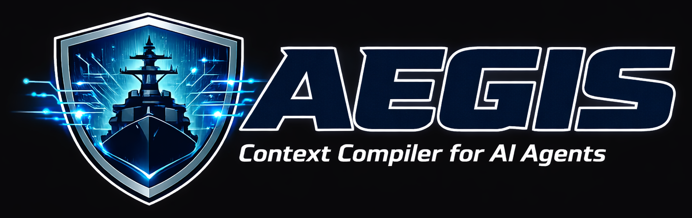

<div align="center">
  
</div>

# Aegis

**AIコーディングエージェント向け DAGベース決定的コンテキストコンパイラ**

[English README](README.md)

Aegis は、AIコーディングエージェントにアーキテクチャガイドラインを強制する MCP サーバーです。RAG の代わりに、依存関係の DAG を使って対象ファイルに必要なドキュメントを決定的にコンパイルします。検索なし。ランキングなし。決定的。

## インストール

### npx で導入（推奨）

クローンもビルドも不要。MCP 設定に書くだけ:

```json
{
  "mcpServers": {
    "aegis": {
      "command": "npx",
      "args": ["-y", "@fuwasegu/aegis", "--surface", "agent"]
    }
  }
}
```

データベースはプロジェクトルートの `.aegis/aegis.db` に保存されます。`.aegis/` ディレクトリは自身の `.gitignore` を含むため、手動設定は不要です。

### ソースからビルド

```bash
git clone https://github.com/yourname/aegis.git
cd aegis
npm install && npm run build
```

### Cursor に追加

プロジェクトの `.cursor/mcp.json` に追加:

```json
{
  "mcpServers": {
    "aegis": {
      "command": "npx",
      "args": ["-y", "@fuwasegu/aegis", "--surface", "agent"]
    }
  }
}
```

初期化後、`aegis_deploy_adapters` を実行すると `.cursor/rules/aegis-process.mdc` が生成されます。「コードを書く前に Aegis に相談し、違反を見つけたら報告せよ」とエージェントに指示する Cursor ルールです。

### Claude Code に追加

```bash
claude mcp add aegis -- npx -y @fuwasegu/aegis --surface agent
```

またはプロジェクトの `.mcp.json` に追加:

```json
{
  "mcpServers": {
    "aegis": {
      "command": "npx",
      "args": ["-y", "@fuwasegu/aegis", "--surface", "agent"]
    }
  }
}
```

初期化後、`aegis_deploy_adapters` を実行すると `CLAUDE.md` に `<!-- aegis:start -->` セクションが追加されます。Claude Code に Aegis ワークフローを指示する内容です。`CLAUDE.md` が無い場合は新規作成します。

### Codex に追加

OpenAI Codex CLI は `AGENTS.md` から指示を読み取ります。`aegis_init_confirm` 後に、Aegis ワークフローを `AGENTS.md` に手動で追加できます:

```markdown
## Aegis プロセス強制

コードを書く前に:
1. 何をするか Plan を作成する。
2. `aegis_compile_context` を target_files と plan 付きで呼ぶ。
3. 返されたアーキテクチャガイドラインを読み、従う。

コードを書いた後に:
4. 返されたガイドラインに対してセルフレビューする。
5. ガイドラインが不足していた場合は `aegis_observe` で compile_miss を報告する。
```

Codex が MCP をサポートしている場合、同様に設定:

```bash
codex mcp add aegis -- npx -y @fuwasegu/aegis --surface agent
```

> **注意:** Codex の MCP サポートは CLI バージョンに依存します。MCP が利用できない場合でも、`AGENTS.md` の指示に従ってエージェントは Aegis のガイドラインを参照できます（ただしツールへの直接アクセスはありません）。

### Admin Surface（初期化・承認用）

Canonical Knowledge を変更する操作（init、propose の approve/reject）には、別途 admin インスタンスを追加:

```json
{
  "mcpServers": {
    "aegis-admin": {
      "command": "npx",
      "args": ["-y", "@fuwasegu/aegis", "--surface", "admin"]
    }
  }
}
```

> **Surface 分離 (INV-6):** Agent Surface は読み取り専用の 4 ツール。Admin Surface は全 15 ツール（共通 4 + Admin 専用 11、Canonical 変更操作を含む）。AIエージェントが人間の承認なしにアーキテクチャルールを変更することを防ぎます。

### SLM 拡張コンテキスト（Intent Tagging）— オプトイン

Aegis は llama.cpp エンジンを内蔵しており、オプションで SLM 推論を利用できます。SLM は**デフォルトで無効**です。決定的 DAG ベースのコンテキストは SLM なしでも完全に動作します。有効にするには `--slm` を追加:

```json
{
  "mcpServers": {
    "aegis": {
      "command": "npx",
      "args": ["-y", "@fuwasegu/aegis", "--surface", "agent", "--slm", "--model", "qwen3.5-4b"]
    }
  }
}
```

SLM 有効時の初回起動で、選択されたモデルが `~/.aegis/models/` にダウンロードされます（全プロジェクトで共有）。

利用可能なモデル（`--list-models` で一覧表示）:

| 名前 | サイズ | 説明 |
|------|--------|------|
| `qwen3.5-4b` | ~2.5 GB | 推奨デフォルト — 高速・軽量 |
| `qwen3.5-9b` | ~5.5 GB | 高品質 — ベンチマークトップ |

HuggingFace URI を直接指定することも可能: `--model hf:user/repo:file.gguf`

> **レガシー:** Ollama ベースの推論を使いたい場合は `--ollama` フラグが利用可能です。`--ollama` 指定時は SLM が暗黙的に有効化されます。

## 使い方

### 1. プロジェクトを初期化する

Admin Surface を使って、プロジェクトのアーキテクチャを検出し Canonical Knowledge をブートストラップ:

```
aegis_init_detect({ project_root: "/path/to/your/project" })
aegis_init_confirm({ preview_hash: "<detect で返されたハッシュ>" })
```

プロジェクト構造に基づいてシードドキュメント、DAG エッジ、レイヤルールが作成されます。

続けてアダプタルールをデプロイ:

```
aegis_deploy_adapters({ project_root: "/path/to/your/project" })
```

`.cursor/rules/aegis-process.mdc` や `CLAUDE.md` セクションが生成され、Aegis ワークフローが強制されます。

### 2. 開発中に使う

Agent Surface がAIコーディングエージェントにツールを提供:

```
aegis_compile_context({
  target_files: ["src/core/store/repository.ts"],
  plan: "アーカイブ済みオブザベーション用の新しいクエリメソッドを追加"
})
```

編集対象ファイルに関連するアーキテクチャガイドライン、パターン、制約が返されます。

### 3. オブザベーションを報告

エージェントがガイドラインの不足や修正を発見した場合:

```
aegis_observe({
  event_type: "compile_miss",
  related_compile_id: "<compile_context から>",
  related_snapshot_id: "<compile_context から>",
  payload: { target_files: ["..."], review_comment: "エラーハンドリングのガイドラインが不足" }
})
```

### 4. プロポーザルをレビュー

オブザベーションは自動分析されプロポーザルになります。Admin Surface でレビュー・承認:

```
aegis_list_proposals({ status: "pending" })
aegis_approve_proposal({ proposal_id: "<id>" })
```

## MCP ツールリファレンス

### Agent Surface（4ツール）

| ツール | 説明 |
|--------|------|
| `aegis_compile_context` | 対象ファイルの決定的コンテキストをコンパイル |
| `aegis_observe` | オブザベーション記録（compile_miss, review_correction, pr_merged, manual_note, document_import） |
| `aegis_get_compile_audit` | 過去のコンパイルの監査ログを取得 |
| `aegis_init_detect` | プロジェクト分析と初期化プレビュー生成 |

### Admin Surface（追加 11 ツール）

| ツール | 説明 |
|--------|------|
| `aegis_init_confirm` | プレビューハッシュで初期化を確認 |
| `aegis_list_proposals` | プロポーザル一覧（ステータスフィルタ付き） |
| `aegis_get_proposal` | プロポーザル詳細とエビデンスの取得 |
| `aegis_approve_proposal` | 保留中のプロポーザルを承認 |
| `aegis_reject_proposal` | プロポーザルを理由付きで却下 |
| `aegis_check_upgrade` | テンプレートバージョンのアップグレード確認 |
| `aegis_apply_upgrade` | テンプレートアップグレードのプロポーザル生成 |
| `aegis_archive_observations` | 古いオブザベーションをアーカイブ |
| `aegis_import_doc` | 既存ドキュメントの内容を new_doc プロポーザルとしてインポート（コンテンツベース、ファイルパス不要） |
| `aegis_process_observations` | 未分析のオブザベーションに対して分析パイプラインを実行 |
| `aegis_deploy_adapters` | アダプタルール（Cursor .mdc, CLAUDE.md 等）をプロジェクトにデプロイ |

## CLI フラグ

| フラグ | デフォルト | 説明 |
|--------|-----------|------|
| `--surface` | `agent` | `agent` または `admin` |
| `--db` | `.aegis/aegis.db` | SQLite データベースパス |
| `--templates` | `./templates` | 同梱テンプレートディレクトリ |
| `--template-dir` | | 追加テンプレート検索パス（ローカルが同梱を上書き） |
| `--slm` | false | SLM を有効化（拡張コンテキスト: Intent Tagging） |
| `--model` | `qwen3.5-4b` | SLM モデル名または HuggingFace URI（`--slm` 必須） |
| `--list-models` | | 利用可能なモデルを表示して終了 |
| `--ollama` | false | 内蔵 llama.cpp の代わりに Ollama を使用（`--slm` を暗黙的に有効化） |
| `--ollama-url` | `http://localhost:11434` | Ollama API URL（`--ollama` 使用時） |

## テンプレート

Aegis には以下のアーキテクチャテンプレートが同梱されています:

| テンプレート | 検出条件 | 説明 |
|------------|----------|------|
| `laravel-ddd` | `composer.json` + Laravel | DDD + Clean Architecture |
| `generic-layered` | `src/` ディレクトリ | 言語非依存レイヤードアーキテクチャ |
| `typescript-mcp` | `package.json` + `tsconfig.json` + MCP SDK | TypeScript MCP サーバー |

---

## 開発

### ビルド・テスト

```bash
npm run build    # TypeScript コンパイル
npm test         # 全テスト実行（227+）
npm run test:watch
```

### アーキテクチャ

```
┌─ MCP層 (src/mcp/) ─────────────────────┐
│ ツール登録、Surface 分離                  │
└──────────────┬──────────────────────────┘
               │
┌─ Core層 (src/core/) ───────────────────┐
│ ContextCompiler, Repository, Init,      │
│ Automation (各種 Analyzer), Tagging     │
└──────────────┬──────────────────────────┘
               │
┌─ Adapters (src/adapters/) ──────────────┐
│ Cursor, Claude ルール生成                │
└──────────────┬──────────────────────────┘
               │
┌─ Expansion (src/expansion/) ────────────┐
│ llama.cpp エンジン, IntentTagger          │
└─────────────────────────────────────────┘
```

依存は下方向のみ。Core は MCP、Adapters、Expansion からインポートしません。

### 主要コンセプト

- **Canonical Knowledge（正典）**: 承認済みアーキテクチャドキュメント + DAG エッジ
- **Observation Layer**: エージェントが報告するイベント（コンパイルミス、修正提案、PR マージ）
- **Proposed Layer**: 人間の承認を必要とする自動生成プロポーザル
- **Snapshots**: Canonical Knowledge のイミュータブルなコンテンツアドレス可能バージョン

## ライセンス

ISC
